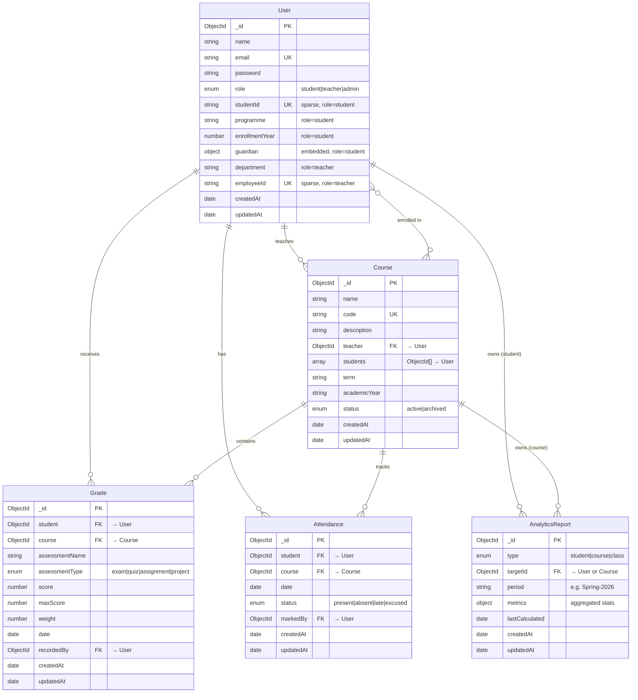

# Database Schema Document

**Project:** Student Performance Analytics Portal  
**Database:** MongoDB (via Mongoose ODM)  
**Version:** 1.0  
**Last Updated:** July 2026

---

## 1. Schema Design Overview

SPAP uses **five MongoDB collections** organized around the primary entities of the academic domain. Documents are referenced by `ObjectId` where the related data is independently mutable or queried separately; embedding is reserved for tightly coupled, read-together sub-documents such as guardian info within a user profile.

### Why Reference-Heavy (Normalized) Over Embedded?

- Grades, attendance, and course enrollments are **independently created, updated, and queried** — embedding them inside a user document would cause unbounded document growth and write contention.
- Analytics reports need to be **denormalized snapshots** — stored as separate documents that can be dropped and recomputed without touching operational data.
- `ObjectId` references keep documents small, make indexing predictable, and enable `populate()` / `$lookup` joins when needed for API responses.

The one exception: **guardian information** is embedded inside the user document because it is always read with the student profile and never queried independently.

---

## 2. ER Diagram



---

## 3. Collection Specifications

### 3.1 `users`

A single collection for all roles using a **discriminated schema** — common fields apply to everyone; role-specific fields are optional and validated conditionally.

| Field | Type | Required | Default | Notes |
|---|---|---|---|---|
| `_id` | ObjectId | auto | — | Primary key |
| `name` | String | **yes** | — | Trimmed |
| `email` | String | **yes** | — | Unique, lowercase, validated with regex |
| `password` | String | **yes** | — | bcrypt-hashed, `minlength: 6`, `select: false` |
| `role` | String | **yes** | `"student"` | Enum: `student`, `teacher`, `admin` |
| `studentId` | String | role=`student` | — | Unique, sparse index (null for teachers/admins) |
| `programme` | String | role=`student` | — | e.g. "Computer Science" |
| `enrollmentYear` | Number | role=`student` | — | e.g. 2024 |
| `guardian` | Object | no | `{}` | Embedded sub-document |
| `guardian.name` | String | no | `""` | |
| `guardian.phone` | String | no | `""` | |
| `guardian.email` | String | no | `""` | |
| `department` | String | role=`teacher` | — | e.g. "Mathematics" |
| `employeeId` | String | role=`teacher` | — | Unique, sparse index |
| `createdAt` | Date | auto | — | Mongoose `timestamps` |
| `updatedAt` | Date | auto | — | Mongoose `timestamps` |

**Indexes:**

| Index | Type | Fields | Rationale |
|---|---|---|---|
| `email_unique` | unique | `{ email: 1 }` | Login lookups, registration duplicate check |
| `role_idx` | plain | `{ role: 1 }` | Filter users by role (admin user list) |
| `studentId_sparse` | unique, sparse | `{ studentId: 1 }` | Student ID lookup; sparse excludes nulls for non-students |
| `employeeId_sparse` | unique, sparse | `{ employeeId: 1 }` | Teacher lookup; sparse excludes nulls |

**Relationship justification — User ↔ Student profile:**

The original design used separate `users` and `students` collections with a `user` ref on Student. The discriminator approach (single collection) is preferred here because:
- A student is a user — they share the same authentication lifecycle.
- Role-specific fields (`studentId`, `programme`) are only 4–5 fields; they don't bloat the user document.
- It eliminates a `populate()` call on every student read.
- The `sparse` index ensures non-student documents don't consume index space.

The guardian object is **embedded** because it is always read alongside the student profile and never queried (filtered) independently.

---

### 3.2 `courses`

Represents a class or subject section. Links a teacher to enrolled students for a given term.

| Field | Type | Required | Default | Notes |
|---|---|---|---|---|
| `_id` | ObjectId | auto | — | Primary key |
| `name` | String | **yes** | — | e.g. "Data Structures" |
| `code` | String | **yes** | — | Unique, e.g. "CS-201" |
| `description` | String | no | `""` | |
| `teacher` | ObjectId | **yes** | — | Ref → `users` (must have role=`teacher`) |
| `students` | [ObjectId] | no | `[]` | Array of refs → `users` (role=`student`) |
| `term` | String | **yes** | — | e.g. "Spring", "Fall", "Summer" |
| `academicYear` | String | **yes** | — | e.g. "2025-2026" |
| `status` | String | **yes** | `"active"` | Enum: `active`, `archived` |
| `createdAt` | Date | auto | — | Mongoose `timestamps` |
| `updatedAt` | Date | auto | — | Mongoose `timestamps` |

**Indexes:**

| Index | Type | Fields | Rationale |
|---|---|---|---|
| `code_unique` | unique | `{ code: 1 }` | Course lookup by code |
| `teacher_idx` | plain | `{ teacher: 1 }` | "My courses" for teachers |
| `students_idx` | multikey | `{ students: 1 }` | "My courses" for students |
| `term_year_idx` | compound | `{ term: 1, academicYear: 1 }` | Filter courses by term |

**Relationship justification:**

- `teacher` is an **ObjectId ref** because the teacher is independently managed (profile edits, login, etc.) and the teacher document may be shared across many courses.
- `students` is an **array of ObjectId refs** because a course can have tens to hundreds of students. Embedding full student documents would be untenable for class-level queries (e.g., "get all students in CS-201") and would duplicate student data across every course they attend. Instead, `populate()` resolves names on read, and the `multikey` index enables fast lookups by student.

---

### 3.3 `grades`

Each document represents a single assessment result for one student in one course.

| Field | Type | Required | Default | Notes |
|---|---|---|---|---|
| `_id` | ObjectId | auto | — | Primary key |
| `student` | ObjectId | **yes** | — | Ref → `users` |
| `course` | ObjectId | **yes** | — | Ref → `courses` |
| `assessmentName` | String | **yes** | — | e.g. "Midterm Exam", "Homework 3" |
| `assessmentType` | String | **yes** | — | Enum: `exam`, `quiz`, `assignment`, `project` |
| `score` | Number | **yes** | — | `min: 0` |
| `maxScore` | Number | **yes** | `100` | Defaults to 100 for percentage-based scoring |
| `weight` | Number | no | `1` | Weight factor for computing weighted averages (default 1 = equal weight) |
| `date` | Date | **yes** | `Date.now` | When the assessment was taken/submitted |
| `recordedBy` | ObjectId | no | — | Ref → `users` (the teacher/admin who entered it) |
| `createdAt` | Date | auto | — | Mongoose `timestamps` |
| `updatedAt` | Date | auto | — | Mongoose `timestamps` |

**Indexes:**

| Index | Type | Fields | Rationale |
|---|---|---|---|
| `student_course_idx` | compound | `{ student: 1, course: 1 }` | "All grades for student X in course Y" — the most common query |
| `course_assessment_idx` | compound | `{ course: 1, assessmentType: 1 }` | Course-level analytics: exam averages, quiz distributions |
| `date_idx` | plain | `{ date: -1 }` | Recent grades feed, time-range filtering |
| `recordedBy_idx` | plain | `{ recordedBy: 1 }` | Audit: "who recorded what" |

No unique compound index is enforced on `(student, course, assessmentName)` because a student may retake an assessment or have a grade revised (old + new versions). Application logic handles deduplication when needed.

**Relationship justification — why `course` is a ref, not embedded:**

A student receives grades across many courses (potentially 40+ over a degree). Embedding grades inside a course document would make that document grow unbounded each semester and cause write contention when multiple teachers record grades simultaneously. Similarly, embedding grades in the user document would create an unwieldy document. `ObjectId` refs keep writes scoped and queries targeted.

---

### 3.4 `attendance`

Records daily attendance for a student in a specific course session.

| Field | Type | Required | Default | Notes |
|---|---|---|---|---|
| `_id` | ObjectId | auto | — | Primary key |
| `student` | ObjectId | **yes** | — | Ref → `users` |
| `course` | ObjectId | **yes** | — | Ref → `courses` |
| `date` | Date | **yes** | — | Day of the class session |
| `status` | String | **yes** | — | Enum: `present`, `absent`, `late`, `excused` |
| `markedBy` | ObjectId | no | — | Ref → `users` (who recorded it) |
| `createdAt` | Date | auto | — | Mongoose `timestamps` |
| `updatedAt` | Date | auto | — | Mongoose `timestamps` |

**Indexes:**

| Index | Type | Fields | Rationale |
|---|---|---|---|
| `student_course_date_unique` | unique, compound | `{ student: 1, course: 1, date: 1 }` | One record per student per course per day — prevents duplicates |
| `course_date_idx` | compound | `{ course: 1, date: -1 }` | "Today's attendance for course X" — bulk mark form |
| `student_date_idx` | compound | `{ student: 1, date: -1 }` | Per-student attendance timeline |
| `status_idx` | plain | `{ status: 1 }` | Absenteeism reports, filtering by status |

**Relationship justification:**

Attendance records are high-volume (one per student per course session). Embedding them in either the student or course document is untenable for the same reasons as grades. The unique compound index on `(student, course, date)` ensures data integrity — a student can't be marked twice for the same session — and also serves as the primary access pattern index.

---

### 3.5 `analyticsReports`

Precomputed performance snapshots. These are **denormalized caches** that avoid expensive real-time aggregation on every dashboard load. A single report document stores all relevant metrics for a student-course pair or a course-level overview.

| Field | Type | Required | Default | Notes |
|---|---|---|---|---|
| `_id` | ObjectId | auto | — | Primary key |
| `type` | String | **yes** | — | Enum: `student`, `course`, `class` |
| `targetId` | ObjectId | **yes** | — | Ref → `users` (if type=`student`) or `courses` (if type=`course`/`class`) |
| `period` | String | **yes** | — | Normalized period string, e.g. `"Spring-2026"` |
| `metrics` | Object | **yes** | `{}` | See breakdown below |
| `lastCalculated` | Date | **yes** | `Date.now` | Timestamp of last recomputation |
| `createdAt` | Date | auto | — | Mongoose `timestamps` |
| `updatedAt` | Date | auto | — | Mongoose `timestamps` |

**`metrics` sub-fields (type=`student`):**

| Field | Type | Description |
|---|---|---|
| `overallAverage` | Number | Weighted average across all courses, 0–100 |
| `totalAssessments` | Number | Count of all grade documents for this student |
| `attendanceRate` | Number | Percentage of `present` ÷ total records, 0–100 |
| `gradeDistribution` | Object | `{ A: n, B: n, C: n, D: n, F: n }` |
| `courseAverages` | [Object] | Array of `{ courseId, courseName, average, assessmentCount }` |

**`metrics` sub-fields (type=`course`):**

| Field | Type | Description |
|---|---|---|
| `enrolledCount` | Number | Students enrolled |
| `classAverage` | Number | Mean of all student averages in the course, 0–100 |
| `attendanceRate` | Number | Class-wide attendance percentage |
| `gradeDistribution` | Object | `{ A: n, B: n, C: n, D: n, F: n }` |
| `assessmentAverages` | [Object] | Array of `{ assessmentName, classAverage, highScore, lowScore }` |

**Indexes:**

| Index | Type | Fields | Rationale |
|---|---|---|---|
| `type_target_period_unique` | unique, compound | `{ type: 1, targetId: 1, period: 1 }` | One cached report per entity per period — upsert on recalculation |
| `type_idx` | plain | `{ type: 1 }` | Filter by report type |
| `lastCalculated_idx` | plain | `{ lastCalculated: -1 }` | Find stale reports needing recalculation |

**Invalidation strategy:**

Reports are recalculated (upserted) whenever:
1. A new grade or attendance record is created for the relevant student/course.
2. An existing grade or attendance record is updated or deleted.
3. A scheduled cron job runs nightly to recalculate any report where `lastCalculated` is older than the current day.

This means dashboard reads are single-document fetches — no aggregation pipelines, no `$lookup` joins, no scan overhead.

---

## 4. Schema Validation Strategy

### Recommendation: Mongoose Schema Validation

**Rationale:**

| Factor | Mongoose | MongoDB Native JSON Schema |
|---|---|---|
| **Integration** | Built into the ODM already in use; validators run in the application process before the document reaches the database. | Requires separate `$jsonSchema` definitions per collection; applied at the database level only. |
| **Expressiveness** | Supports `required`, `enum`, `min`/`max`, `validate` functions, and `pre`/`post` hooks (e.g. password hashing, cascading deletes). | Covers structural validation but lacks hooks and custom logic. |
| **Error format** | Mongoose `ValidationError` is directly usable in Express error handlers with field-level messages. | MongoDB returns a `WriteError` with a raw `details` array — requires additional parsing. |
| **Portability** | Schema definitions live in code and travel with the application; no separate migration step needed. | Schema is stored in the database and must be applied via `db.createCollection()` or `collMod`. |
| **Overhead** | Mongoose adds a thin validation layer at the application boundary. | Native validation adds zero latency but doesn't replace the need for application-level guards. |

**Dual-layer approach:**

Mongoose validation is the **primary** guard — it runs on every `save()` and `create()` call. For production, add MongoDB native JSON schema validation as a **safety net** via `db.runCommand({ collMod })` on critical collections (users, grades) to prevent accidental writes that bypass the application layer (e.g., direct Compass edits, migration scripts). This is not required during initial development but is recommended before go-live.

**Example — Mongoose conditional validation for the `users` discriminator:**

```js
userSchema.path('studentId').validate(function (value) {
  if (this.role === 'student' && !value) return false;
  return true;
}, 'studentId is required for students');
```

---

## 5. Navigating in MongoDB Compass

When connecting to the database via MongoDB Compass, the collections and fields are designed to be self-explanatory:

```
spap-db (database name)
├── users                 ← "Who are the people?"
│   Fields to filter: role, email, studentId, programme
├── courses               ← "What classes exist?"
│   Fields to filter: code, term, academicYear, status
├── grades                ← "What scores have been recorded?"
│   Fields to filter: student (ObjectId), course (ObjectId), assessmentType, date
├── attendance            ← "Who showed up?"
│   Fields to filter: student, course, date, status
└── analyticsreports      ← "Precomputed stats cache"
    Fields to filter: type, targetId, period, lastCalculated
```

**Naming conventions observed:**

- **Collection names:** lowercase, plural (`users`, `courses`, `grades`, `attendance`). Mongoose automatically pluralizes model names; the Compass listing reflects this.
- **Field names:** camelCase (`studentId`, `maxScore`, `assessmentType`). Consistent across all collections so junior developers and data analysts never guess between `student_id` vs `studentId`.
- **Reference fields:** named after the referenced collection in singular form (`student`, `course`, `teacher`). Compass's "Analyze Schema" view will show these as ObjectId fields, making the foreign-key relationship visually obvious.
- **Date fields:** always `date` or prefixed with context (`lastCalculated`, `createdAt`).
- **Embedded objects:** named as nouns (`guardian`, `metrics`), not verbs, so they read naturally when expanded in Compass's tree view.

---

## 6. Sample Documents

### 6.1 `users`

```json
{
  "_id": { "$oid": "60a1b2c3d4e5f60001000001" },
  "name": "Aisha Khan",
  "email": "aisha.khan@university.edu",
  "password": "$2a$12$...hashed...",
  "role": "student",
  "studentId": "STU-2024-0142",
  "programme": "Computer Science",
  "enrollmentYear": 2024,
  "guardian": {
    "name": "Fatima Khan",
    "phone": "+92-300-1112233",
    "email": "fatima.khan@email.com"
  },
  "createdAt": { "$date": "2024-09-01T08:00:00.000Z" },
  "updatedAt": { "$date": "2026-06-15T14:30:00.000Z" }
}
```

```json
{
  "_id": { "$oid": "60a1b2c3d4e5f60001000002" },
  "name": "Dr. Marcus Rivera",
  "email": "m.rivera@university.edu",
  "password": "$2a$12$...hashed...",
  "role": "teacher",
  "department": "Mathematics",
  "employeeId": "EMP-2019-0087",
  "createdAt": { "$date": "2019-08-15T09:00:00.000Z" },
  "updatedAt": { "$date": "2026-06-20T10:15:00.000Z" }
}
```

```json
{
  "_id": { "$oid": "60a1b2c3d4e5f60001000003" },
  "name": "Priya Sharma",
  "email": "p.sharma@university.edu",
  "password": "$2a$12$...hashed...",
  "role": "admin",
  "createdAt": { "$date": "2021-01-10T11:00:00.000Z" },
  "updatedAt": { "$date": "2026-06-30T09:00:00.000Z" }
}
```

### 6.2 `courses`

```json
{
  "_id": { "$oid": "60c1d2e3f4a5b60001000010" },
  "name": "Data Structures and Algorithms",
  "code": "CS-201",
  "description": "Fundamental data structures, algorithm analysis, and complexity theory.",
  "teacher": { "$oid": "60a1b2c3d4e5f60001000002" },
  "students": [
    { "$oid": "60a1b2c3d4e5f60001000001" },
    { "$oid": "60a1b2c3d4e5f60001000004" },
    { "$oid": "60a1b2c3d4e5f60001000005" }
  ],
  "term": "Spring",
  "academicYear": "2025-2026",
  "status": "active",
  "createdAt": { "$date": "2026-01-10T08:00:00.000Z" },
  "updatedAt": { "$date": "2026-06-28T16:00:00.000Z" }
}
```

```json
{
  "_id": { "$oid": "60c1d2e3f4a5b60001000011" },
  "name": "Linear Algebra",
  "code": "MTH-102",
  "description": "Vectors, matrices, linear transformations, and eigenvalues.",
  "teacher": { "$oid": "60a1b2c3d4e5f60001000002" },
  "students": [
    { "$oid": "60a1b2c3d4e5f60001000001" }
  ],
  "term": "Spring",
  "academicYear": "2025-2026",
  "status": "active",
  "createdAt": { "$date": "2026-01-10T08:00:00.000Z" },
  "updatedAt": { "$date": "2026-06-28T16:00:00.000Z" }
}
```

### 6.3 `grades`

```json
{
  "_id": { "$oid": "60d1e2f3a4b5c60001000020" },
  "student": { "$oid": "60a1b2c3d4e5f60001000001" },
  "course": { "$oid": "60c1d2e3f4a5b60001000010" },
  "assessmentName": "Midterm Exam",
  "assessmentType": "exam",
  "score": 87,
  "maxScore": 100,
  "weight": 2,
  "date": { "$date": "2026-03-15T10:00:00.000Z" },
  "recordedBy": { "$oid": "60a1b2c3d4e5f60001000002" },
  "createdAt": { "$date": "2026-03-15T14:00:00.000Z" },
  "updatedAt": { "$date": "2026-03-15T14:00:00.000Z" }
}
```

```json
{
  "_id": { "$oid": "60d1e2f3a4b5c60001000021" },
  "student": { "$oid": "60a1b2c3d4e5f60001000001" },
  "course": { "$oid": "60c1d2e3f4a5b60001000010" },
  "assessmentName": "Homework 4 — Graph Traversals",
  "assessmentType": "assignment",
  "score": 92,
  "maxScore": 100,
  "weight": 1,
  "date": { "$date": "2026-04-02T08:00:00.000Z" },
  "recordedBy": { "$oid": "60a1b2c3d4e5f60001000002" },
  "createdAt": { "$date": "2026-04-02T16:00:00.000Z" },
  "updatedAt": { "$date": "2026-04-02T16:00:00.000Z" }
}
```

```json
{
  "_id": { "$oid": "60d1e2f3a4b5c60001000022" },
  "student": { "$oid": "60a1b2c3d4e5f60001000001" },
  "course": { "$oid": "60c1d2e3f4a5b60001000011" },
  "assessmentName": "Quiz 1 — Matrix Multiplication",
  "assessmentType": "quiz",
  "score": 18,
  "maxScore": 20,
  "weight": 1,
  "date": { "$date": "2026-02-10T09:00:00.000Z" },
  "recordedBy": { "$oid": "60a1b2c3d4e5f60001000002" },
  "createdAt": { "$date": "2026-02-10T12:00:00.000Z" },
  "updatedAt": { "$date": "2026-02-10T12:00:00.000Z" }
}
```

### 6.4 `attendance`

```json
{
  "_id": { "$oid": "60e1f2a3b4c5d60001000030" },
  "student": { "$oid": "60a1b2c3d4e5f60001000001" },
  "course": { "$oid": "60c1d2e3f4a5b60001000010" },
  "date": { "$date": "2026-02-05T00:00:00.000Z" },
  "status": "present",
  "markedBy": { "$oid": "60a1b2c3d4e5f60001000002" },
  "createdAt": { "$date": "2026-02-05T10:05:00.000Z" },
  "updatedAt": { "$date": "2026-02-05T10:05:00.000Z" }
}
```

```json
{
  "_id": { "$oid": "60e1f2a3b4c5d60001000031" },
  "student": { "$oid": "60a1b2c3d4e5f60001000001" },
  "course": { "$oid": "60c1d2e3f4a5b60001000010" },
  "date": { "$date": "2026-02-07T00:00:00.000Z" },
  "status": "late",
  "markedBy": { "$oid": "60a1b2c3d4e5f60001000002" },
  "createdAt": { "$date": "2026-02-07T10:12:00.000Z" },
  "updatedAt": { "$date": "2026-02-07T10:12:00.000Z" }
}
```

```json
{
  "_id": { "$oid": "60e1f2a3b4c5d60001000032" },
  "student": { "$oid": "60a1b2c3d4e5f60001000001" },
  "course": { "$oid": "60c1d2e3f4a5b60001000010" },
  "date": { "$date": "2026-02-12T00:00:00.000Z" },
  "status": "absent",
  "markedBy": { "$oid": "60a1b2c3d4e5f60001000002" },
  "createdAt": { "$date": "2026-02-12T10:01:00.000Z" },
  "updatedAt": { "$date": "2026-02-12T10:01:00.000Z" }
}
```

### 6.5 `analyticsReports`

```json
{
  "_id": { "$oid": "60f1a2b3c4d5e60001000040" },
  "type": "student",
  "targetId": { "$oid": "60a1b2c3d4e5f60001000001" },
  "period": "Spring-2026",
  "metrics": {
    "overallAverage": 85.67,
    "totalAssessments": 12,
    "attendanceRate": 88.5,
    "gradeDistribution": { "A": 5, "B": 4, "C": 2, "D": 1, "F": 0 },
    "courseAverages": [
      { "courseId": "60c1d2e3f4a5b60001000010", "courseName": "Data Structures", "average": 89.5, "assessmentCount": 8 },
      { "courseId": "60c1d2e3f4a5b60001000011", "courseName": "Linear Algebra", "average": 78.0, "assessmentCount": 4 }
    ]
  },
  "lastCalculated": { "$date": "2026-06-30T02:00:00.000Z" },
  "createdAt": { "$date": "2026-02-01T00:00:00.000Z" },
  "updatedAt": { "$date": "2026-06-30T02:00:00.000Z" }
}
```

```json
{
  "_id": { "$oid": "60f1a2b3c4d5e60001000041" },
  "type": "course",
  "targetId": { "$oid": "60c1d2e3f4a5b60001000010" },
  "period": "Spring-2026",
  "metrics": {
    "enrolledCount": 32,
    "classAverage": 81.4,
    "attendanceRate": 85.2,
    "gradeDistribution": { "A": 8, "B": 10, "C": 9, "D": 3, "F": 2 },
    "assessmentAverages": [
      { "assessmentName": "Midterm Exam", "classAverage": 78.5, "highScore": 98, "lowScore": 42 },
      { "assessmentName": "Final Project", "classAverage": 86.2, "highScore": 100, "lowScore": 65 }
    ]
  },
  "lastCalculated": { "$date": "2026-06-30T02:30:00.000Z" },
  "createdAt": { "$date": "2026-02-01T00:00:00.000Z" },
  "updatedAt": { "$date": "2026-06-30T02:30:00.000Z" }
}
```

---

## 7. Index Strategy Summary

Below is the consolidated list of every index across all collections for quick reference:

| # | Collection | Index Name | Fields | Type | Purpose |
|---|---|---|---|---|---|
| 1 | users | `email_unique` | `{ email: 1 }` | unique | Auth, duplicate prevention |
| 2 | users | `role_idx` | `{ role: 1 }` | plain | Admin user listings |
| 3 | users | `studentId_sparse` | `{ studentId: 1 }` | unique, sparse | Student ID lookups |
| 4 | users | `employeeId_sparse` | `{ employeeId: 1 }` | unique, sparse | Teacher lookup |
| 5 | courses | `code_unique` | `{ code: 1 }` | unique | Course lookup by code |
| 6 | courses | `teacher_idx` | `{ teacher: 1 }` | plain | Teacher's course list |
| 7 | courses | `students_idx` | `{ students: 1 }` | multikey | Student's course list |
| 8 | courses | `term_year_idx` | `{ term: 1, academicYear: 1 }` | compound | Term filtering |
| 9 | grades | `student_course_idx` | `{ student: 1, course: 1 }` | compound | Per-student, per-course grades |
| 10 | grades | `course_assessment_idx` | `{ course: 1, assessmentType: 1 }` | compound | Course analytics |
| 11 | grades | `date_idx` | `{ date: -1 }` | plain | Recent grade feed |
| 12 | grades | `recordedBy_idx` | `{ recordedBy: 1 }` | plain | Audit trail |
| 13 | attendance | `student_course_date_unique` | `{ student: 1, course: 1, date: 1 }` | unique, compound | Duplicate prevention + primary access |
| 14 | attendance | `course_date_idx` | `{ course: 1, date: -1 }` | compound | Bulk attendance by course |
| 15 | attendance | `student_date_idx` | `{ student: 1, date: -1 }` | compound | Student timeline |
| 16 | attendance | `status_idx` | `{ status: 1 }` | plain | Status filtering |
| 17 | analyticsreports | `type_target_period_unique` | `{ type: 1, targetId: 1, period: 1 }` | unique, compound | One report per entity per period |
| 18 | analyticsreports | `type_idx` | `{ type: 1 }` | plain | Filter by type |
| 19 | analyticsreports | `lastCalculated_idx` | `{ lastCalculated: -1 }` | plain | Staleness detection |

---

## 8. Notes on the Existing Codebase

The codebase currently uses separate `User` and `Student` models (a `1:1` ref relationship). This document recommends consolidating into a single `users` collection with role discriminators (Section 3.1). If migrating the existing code, the steps would be:

1. Extend the `User` schema with the student-specific fields (`studentId`, `programme`, `enrollmentYear`, `guardian`) as optional.
2. Add Mongoose conditional validators that enforce those fields only when `role === 'student'`.
3. Run a one-time migration script to merge `students` documents into their corresponding `users` documents.
4. Remove the `Student` model and update all controllers/routes/services that currently import it.

The existing `Grade` and `Attendance` models reference `Student` directly. After the migration they should reference `User` (the consolidated collection) and also add the new `course` field.
