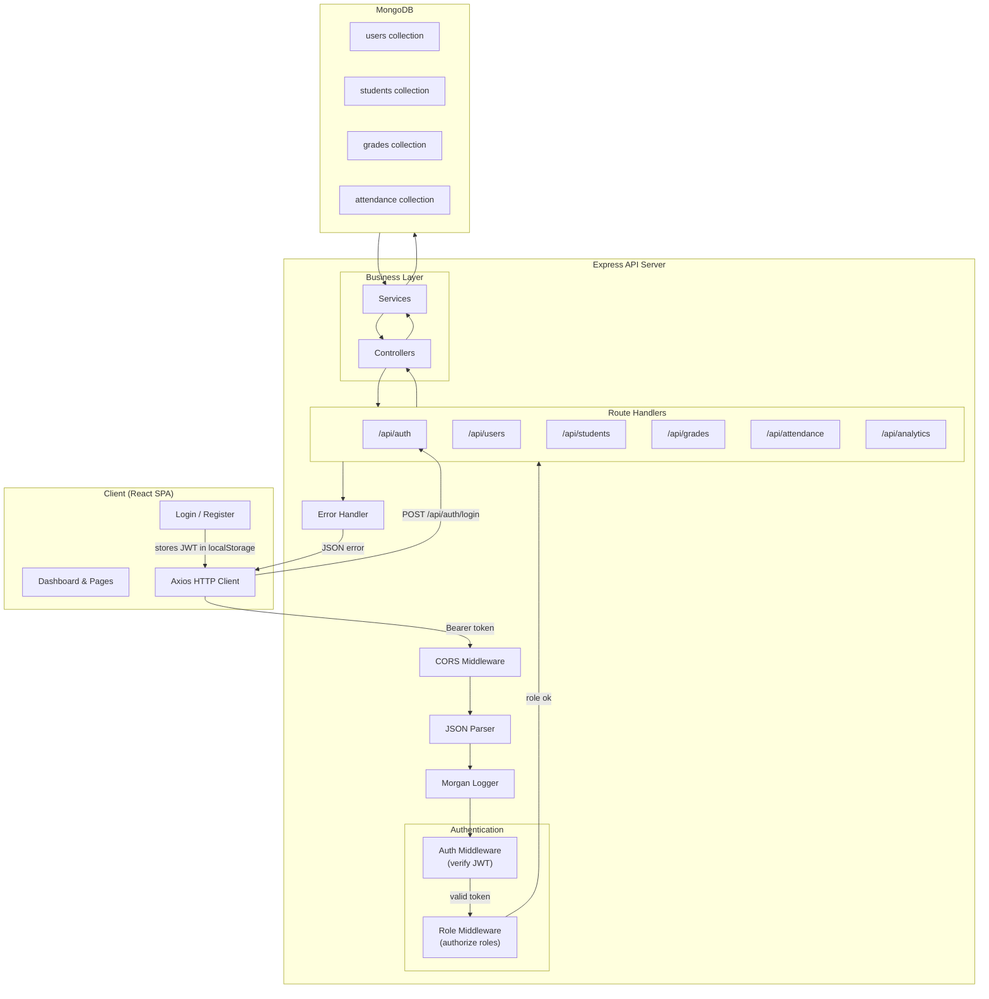
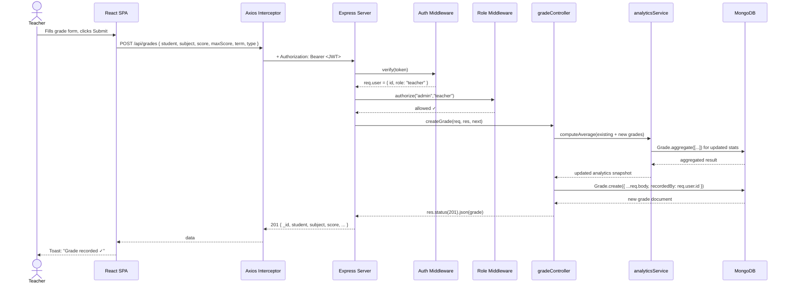

# System Architecture Document

**Project:** Student Performance Analytics Portal  
**Stack:** MongoDB · Express · React · Node.js (MERN)  
**Version:** 1.0  
**Last Updated:** July 2026

---

## 1. High-Level Overview

The **Student Performance Analytics Portal (SPAP)** is a web-based academic performance platform serving three user roles:

| Role | Responsibilities |
|---|---|
| **Student** | View personal grades, attendance records, and performance analytics |
| **Teacher** | Record grades, mark attendance, view class-level analytics |
| **Admin** | Manage users and student profiles; access all data and reports |

The system aggregates assessment scores and attendance data into dashboards and charts, giving each role contextual visibility into academic performance. A JWT-based authentication layer enforces role-based access control (RBAC) on every protected endpoint.

---

## 2. Architecture Style

SPAP follows a **three-tier client-server architecture** with clear separation of concerns:

- **Presentation Tier** — React single-page application (SPA) built with Vite, Tailwind CSS, and Recharts. Communicates exclusively via RESTful HTTP calls to the API.
- **Application Tier** — Node.js/Express REST API. Handles authentication, authorization, input validation, business logic, and data aggregation. Stateless—no server-side sessions.
- **Data Tier** — MongoDB (via Mongoose ODM). Documents are stored as JSON/BSON in collections for users, students, grades, and attendance records.

```
┌──────────────────┐     HTTPS / REST      ┌──────────────────┐     Mongoose      ┌──────────────────┐
│   React SPA      │ ◄────────────────────►│  Express API     │ ◄───────────────►│    MongoDB       │
│   (Vite + TW)    │   JSON, JWT Bearer    │  (Node.js)       │   BSON / async    │   (Atlas/local)  │
└──────────────────┘                       └──────────────────┘                   └──────────────────┘
```

---

## 3. Mermaid Architecture Diagram

The diagram below shows the system topology with the authentication flow and where RBAC middleware sits in the Express request lifecycle.



**Request lifecycle summary:**

1. Client attaches the JWT as an `Authorization: Bearer <token>` header via an Axios interceptor.
2. `auth` middleware decodes and verifies the token; attaches `req.user`.
3. `role` middleware checks `req.user.role` against the required roles for the endpoint.
4. Controller delegates business logic to a service layer, which queries/updates MongoDB via Mongoose.
5. Response (or error) flows back through the same stack.

---

## 4. Request/Response Lifecycle: Teacher Submits Grades



**Key points:**

- Validation happens at two levels: Mongoose schema validation (data integrity) and optional `express-validator` sanitization in routes.
- The controller never holds business logic; it delegates to services.
- Analytics are recalculated eagerly on write so dashboard reads stay fast.

---

## 5. Component Breakdown

### 5.1 Frontend (`client/`)

| Layer | Directory | Purpose |
|---|---|---|
| Pages | `src/pages/` | Route-level components; each maps 1:1 to a URL path |
| Feature components | `src/components/analytics/`, `dashboard/` | Chart widgets, stat cards, activity feeds |
| Auth components | `src/components/auth/` | Login and registration forms |
| Shared UI | `src/components/shared/` | Layout shell, sidebar, header, DataTable, Modal, StatCard |
| State management | `src/context/AuthContext.jsx` | Global auth state (user, token, login/logout/register actions) |
| Data fetching | `src/hooks/useFetch.js` | Generic GET hook with loading/error/refetch |
| API layer | `src/services/api.js` → `*Service.js` | Axios instance with base URL + JWT interceptor; one service file per domain |
| Utilities | `src/utils/` | Constants (roles, nav links), formatters, helpers |

### 5.2 Backend (`server/`)

| Layer | Directory | Purpose |
|---|---|---|
| Entry point | `src/server.js` | Bootstraps Express, mounts middleware and route modules |
| Configuration | `src/config/` | Database connection (`db.js`), env var access (`env.js`) |
| Models | `src/models/` | Mongoose schemas: User, Student, Grade, Attendance |
| Controllers | `src/controllers/` | Thin handlers — parse request, call service, send response |
| Services | `src/services/` | Business logic (auth, analytics aggregation, grade calculations) |
| Middleware | `src/middleware/` | Auth (JWT verification), Role (RBAC factory), centralized error handler |
| Routes | `src/routes/` | Express router per domain; binds HTTP verbs → controllers + middleware |
| Utilities | `src/utils/` | Custom `ApiError` class, shared constants |

### 5.3 Database (`MongoDB`)

| Collection | Key Fields | Indexes |
|---|---|---|
| `users` | `name`, `email` (unique), `password` (hashed), `role` (enum) | `email` (unique) |
| `students` | `user` (ref), `studentId` (unique), `programme`, `enrollmentYear`, `guardian` | `studentId` (unique), `user` |
| `grades` | `student` (ref), `subject`, `score`, `maxScore`, `term`, `assessmentType`, `recordedBy` | `student + subject + term` (compound for queries) |
| `attendances` | `student` (ref), `date`, `subject`, `status`, `markedBy` | `student + date + subject` (unique compound) |

---

## 6. Key Architectural Decisions

### 6.1 REST over GraphQL

**Rationale:** The data shape is well-defined and relatively flat (students, grades, attendance). All clients consume the same endpoints with minimal over/under-fetching risk. REST is simpler to implement, debug, cache, and secure with standard middleware. GraphQL would add unnecessary complexity for this scope and team size.

### 6.2 MongoDB over Relational SQL

**Rationale:** Academic data is inherently document-oriented — a student aggregates grades and attendance across terms. Embedding or referencing sub-documents maps naturally to Mongoose schemas. MongoDB's aggregation pipeline (`$group`, `$switch`, `$avg`) handles dashboard analytics without a separate OLAP layer. Flexible schema accommodates evolving requirements (e.g., adding new assessment types) without migrations.

### 6.3 JWT (Stateless) over Session-Based Auth

**Rationale:** JWTs eliminate server-side session storage, simplifying horizontal scaling. The token carries the user ID and role, so every request is self-contained. Token expiry (`JWT_EXPIRES_IN`) and the absence of refresh tokens keep the implementation straightforward for an application of this size.

### 6.4 Eager Analytics Recalculation

**Rationale:** Whenever a grade or attendance record is created or updated, the relevant aggregates (class average, grade distribution, attendance rate) are recomputed and cached in-memory or stored as pre-aggregated documents. This trades a small write-time overhead for instant dashboard reads, which are far more frequent than writes.

### 6.5 Monorepo with `client/` and `server/`

**Rationale:** Keeps frontend and backend code versioned together. Enables shared constants (role names, assessment types) and simplifies CI/CD with a single repository. Type sharing across client and server is trivial if TypeScript is adopted later.

---

## 7. Non-Functional Considerations

### 7.1 Scalability

| Concern | Approach |
|---|---|
| **Horizontal scaling** | Stateless Express servers can be replicated behind a load balancer (NGINX, PM2 cluster mode, or a PaaS auto-scaler). |
| **Database scaling** | MongoDB Atlas offers automated sharding and replica sets. For read-heavy dashboards, add read-only secondary nodes. |
| **Analytics at scale** | If grade/attendance volume grows significantly, move aggregation to scheduled background jobs (Agenda / Bull) and persist pre-computed summaries in a `reports` collection. Consider a materialized view pattern. |
| **CDN** | Serve the React build (`client/dist/`) from a CDN (Vercel, Netlify, Cloudflare Pages) to offload static assets from the API server. |

### 7.2 Security

| Concern | Implementation |
|---|---|
| **Authentication** | JWT signed with `JWT_SECRET`; no passwords in tokens; tokens expire after `JWT_EXPIRES_IN`. |
| **Password storage** | bcrypt with cost factor 12 via Mongoose pre-save hook. |
| **Authorization** | RBAC enforced by `role` middleware factory on every protected route. |
| **Input validation** | `express-validator` sanitization on route handlers; Mongoose schema-level validation as a second guard. |
| **Rate limiting** | Add `express-rate-limit` middleware globally and on `/api/auth` endpoints to prevent brute-force attacks. |
| **CORS** | Restricted to `CLIENT_URL` environment variable; no wildcard origins in production. |
| **HTTP headers** | Use `helmet` middleware to set secure headers (CSP, X-Frame-Options, etc.). |
| **Environment isolation** | Secrets (JWT secret, DB URI) loaded from `.env` and never committed (`.gitignore` enforced). |

### 7.3 Deployment Target

| Component | Recommended Platform | Rationale |
|---|---|---|
| **Client (static)** | **Vercel** or **Netlify** | Zero-config deploys for Vite SPA; free tier covers this scope; automatic HTTPS and CDN edge caching. |
| **Server (Node.js)** | **Render** or **Railway** | Native Node support, environment variable management, auto-deploy from Git, free tier adequate for dev/small-scale. |
| **Database** | **MongoDB Atlas** | Free M0 cluster (512 MB), automated backups, monitoring dashboard, VPC peering. |
| **Alternative (all-in-one)** | **DigitalOcean App Platform** or **Fly.io** | Deploy both client and server from a single repo if a unified PaaS is preferred. |

### 7.4 Observability

- Use `morgan` (already configured) for HTTP request logging in development.
- In production, pipe logs to a service like **Papertrail** or **Logtail**.
- Monitor MongoDB Atlas metrics (slow queries, connections, disk IO) via the Atlas dashboard.
- Add a `/api/health` endpoint (already implemented) for uptime checks.
